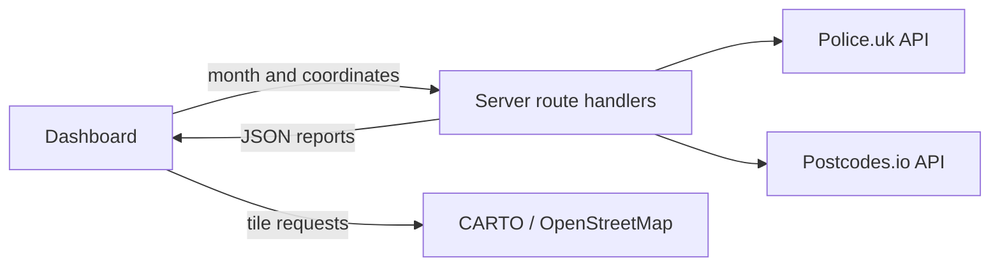

# Crime Atlas

A portfolio data-visualisation project designed by Nimesh Rawanage for exploring published police crime reports around places in England, Wales and Northern Ireland.

Choose a city, search a postcode or click a point on the map. Crime Atlas retrieves reports within one mile, displays their approximate concentration as a heatmap, and breaks down the results by crime type and reporting month.

**These are monthly published reports, not live incidents or predictions. General Scottish crime coverage is not available in this data source.**

## Features

- Interactive Leaflet heatmap with an explicit one-mile query boundary.
- Ten city shortcuts, postcode lookup and map-point selection.
- Reporting months loaded from Police.uk rather than hard-coded dates.
- Crime-type filtering with report counts and a category breakdown.
- Responsive layout, keyboard-accessible selectors and status messages.
- Server-side data requests, bounded upstream timeouts and clear failure states.
- No application accounts, database or API keys required.

## Run locally

Requirements: Node.js **22.13 or later** and **pnpm 11.19.0**. Internet access is needed for dependency installation, data requests and map tiles.

```bash
git clone https://github.com/NimeshRawanage/crime-atlas.git
cd crime-atlas
pnpm install --frozen-lockfile
pnpm dev
```

Open the local address printed by the development server, usually `http://localhost:3000`.

```bash
pnpm check       # Type checking, deterministic tests, lint and production build
pnpm start       # Serve the production build after pnpm build
```

If pnpm is not installed, install the pinned version using your Node.js package manager: `npm install --global pnpm@11.19.0`.

## How to use it

1. Select a city or enter a UK postcode.
2. Pick an available reporting month.
3. Select a crime type, or click a category in the breakdown; click it again to show all types.
4. Click another point on the map to request a new one-mile area. Panning and zooming alone do not change the query.
5. Use Refresh to request the selected reports again. Upstream and browser caching can still apply.

The most-reported type and category breakdown describe **all returned reports**. The matching-report total and heatmap follow the selected crime-type filter.

## Technical overview

| Layer               | Technology                           | Purpose                                                      |
| ------------------- | ------------------------------------ | ------------------------------------------------------------ |
| Interface           | React 19, TypeScript                 | Controls, state and report summaries                         |
| Application runtime | Vinext, Vite                         | App Router rendering and server route handlers               |
| Map                 | Leaflet, Leaflet.heat                | Basemap, query boundary and heat overlay                     |
| Controls and styles | Base UI, shadcn/ui, Tailwind CSS     | Select controls and visual styling                           |
| Data                | Police.uk, Postcodes.io              | Published reports, available months and postcode coordinates |
| Validation          | TypeScript, Node test runner, Oxlint | Type checks and API contract tests                           |

Vinext is pinned to a beta release. Treat this as a portfolio application and assess runtime compatibility before adopting it for a production service.



## Documentation

- [Architecture and implementation decisions](docs/architecture.md)
- [Data sources, interpretation and attribution](docs/data-sources.md)
- [API reference](docs/api.md)
- [Deployment and operations](docs/deployment.md)
- [Testing and manual verification](docs/testing.md)
- [Contributing](CONTRIBUTING.md)
- [Security considerations](SECURITY.md)

## Limitations

- Coverage and completeness vary by police force and month. A blank map is not evidence that no crime occurred.
- Locations are anonymised. Several reports can share the same approximate position.
- Heat intensity varies with zoom and overlapping points. It is not a population-adjusted crime rate or safety score.
- Each query covers a local one-mile radius, not a complete UK-wide dataset.
- There is no live monitoring, forecasting, background polling, saved-search history or user tracking in application code.
- Scotland is rejected by postcode lookup. Map clicks there may return empty or limited transport-police data; the map does not contain a national-boundary classifier.
- External services can be unavailable or impose limits. Request cancellation prevents stale responses updating the interface, but may not stop upstream work already in progress.

## Ownership and third-party material

Designed and maintained by [Nimesh Rawanage](https://github.com/NimeshRawanage). Third-party component notices are preserved in [THIRD_PARTY_NOTICES.md](THIRD_PARTY_NOTICES.md). Dependencies retain their respective licences. Police data is supplied under the Open Government Licence v3.0; map and postcode attribution is described in the data documentation.

No general reuse licence is granted for the project-specific code. Contact the maintainer before reusing it beyond rights supplied by the repository host or applicable law.
